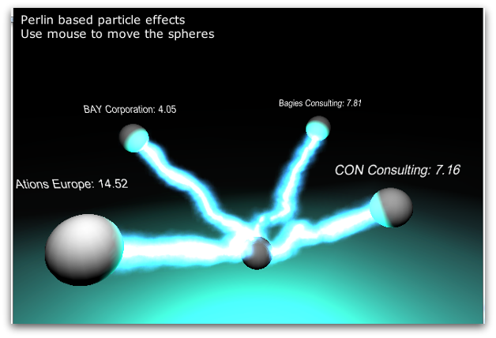

# Lightstreamer - Stock-List Demo - Unity Client #

<!-- START DESCRIPTION lightstreamer-example-stocklist-client-unity -->

This project includes a demo client showing the integration between a modified version of the [Lightstreamer .NET Client Library](http://www.lightstreamer.com/docs/client_dotnet_api/frames.html) and the Unity 3D Development platform. 

 

At this time, Unity 3D support is experimental and some features may not work. Specifically, the Web Player build (the non-NaCL version) is known to NOT work. Moreover, the Android build fails due to errors in the original Unity 3D code.

## Dig the Code ##

The .NET code is located inside the `Assets/Sources` directory. 
Specifically, Lightstreamer connection information is defined inside LightningBolt.cs (pushServerHost, items, fields).
LightstreamerClient.cs, ILightstreamerListener.cs, StocklistConnectionListener.cs and StocklistHandyTableListener.cs are the Lightstreamer bits in this demo.

* <b>StockListConnectionListener.cs</b>: it's the Lightstreamer ConnectionListener implementation that is passed to LSClient for receiving connection-related events. In this project, this object routes all the events to ILightstreamerListener.
* <b>StocklistHandyTableListener.cs</b>: it's the Lightstreamer HandyTableListener implementation that is passed to LSClient for receiving data-related events. In this project, this object routes all the events to ILightstreamerListener.
* <b>LightstreamerClient.cs</b>: it's a wrapper class that encapsulates the Lightstreamer LSClient object, exposting start() and stop() methods.

Check out the sources for further explanations. The Lightstreamer Documentation is available at: http://www.lightstreamer.com/doc 

<i>NOTE: not all the functionalities of the modified Lightstreamer .NET Client Library are exposed by the classes listed above. You can easily expand those functionalities using the [Lightstreamer .NET Client API](http://www.lightstreamer.com/docs/client_dotnet_api/frames.html) as a reference. </i>

For any inquiry, please email support@lightstreamer.com.

<!-- END DESCRIPTION lightstreamer-example-stocklist-client-unity -->

# Build #

The Unity 3D Development platform must be installed in order to build and run this demo. 
This demo is a modified version of the official Unity [Procedural Examples] (https://www.assetstore.unity3d.com/#/content/5141) demo. In particular, the "Lightning Bolt" demo (Lightning Bolt.unity file) is the one containing the modified Lightstreamer .NET Client library code.

## Getting Started, Compile & Run ##

* Download and Install Unity 3D from: [http://unity3d.com/unity/download](http://unity3d.com/unity/download)
* Clone this project: `> git clone https://github.com/Weswit/Lightstreamer-example-StockList-client-unity`
* Open `Assets/Lightning bolt.unity` double clicking on it. The Unity Development Environment should open.

You can then Build & Run the "Lightning Bolt" project for Windows or MacOSX.

## Running your own Lightstreamer Server ##

If you intend to change the pushServerHost variable inside LightningBolt.cs,  pointing the demo to your own Lightstreamer Server, you are also required to run a Socket Policy Server on the same host, as explained at [Security Sandbox of the Webplayer] (http://unity3d.com/support/documentation/Manual/Security%20Sandbox.html)

Unity 3D provides a C# based Policy Server. However, a Java-based version of the Policy Server is provided with this demo and is available inside the `SocketPolicyServer` directory.
In order to use the Java-based version of the Policy Server: compile it with command `javac Sockpol.java` and launch it with command `java Sockpol cdpolicy.xml`.

# See Also #

## Lightstreamer Adapters Needed by This Demo Client ##

<!-- START RELATED_ENTRIES -->
* [Lightstreamer - Stock- List Demo - Java Adapter](https://github.com/Weswit/Lightstreamer-example-Stocklist-adapter-java)
* [Lightstreamer - Reusable Metadata Adapters- Java Adapter](https://github.com/Weswit/Lightstreamer-example-ReusableMetadata-adapter-java)

<!-- END RELATED_ENTRIES -->

## Related Projects ##

* [Lightstreamer - Stock-List Demos - HTML Clients](https://github.com/Weswit/Lightstreamer-example-Stocklist-client-javascript)
* [Lightstreamer - Basic Stock-List Demo - jQuery (jqGrid) Client](https://github.com/Weswit/Lightstreamer-example-StockList-client-jquery)
* [Lightstreamer - Stock-List Demo - Dojo Toolkit Client](https://github.com/Weswit/Lightstreamer-example-StockList-client-dojo)
* [Lightstreamer - Basic Stock-List Demo - Java SE (Swing) Client](https://github.com/Weswit/Lightstreamer-example-StockList-client-java)
* [Lightstreamer - Basic Stock-List Demo - .NET Client](https://github.com/Weswit/Lightstreamer-example-StockList-client-dotnet)
* [Lightstreamer - Stock-List Demos - Flex Clients](https://github.com/Weswit/Lightstreamer-example-StockList-client-flex)
* [Lightstreamer - Basic Stock-List Demo - Silverlight Client](https://github.com/Weswit/Lightstreamer-example-StockList-client-silverlight)
* [Lightstreamer - 3D World Demo - HTML (Three.js) Client](https://github.com/Weswit/Lightstreamer-example-3DWorld-client-javascript)

# Lightstreamer Compatibility Notes #

- Compatible with Lightstreamer .NET Client API version 2.1 or newer.
- For Lightstreamer Allegro (+ .NET Client API support), Presto, Vivace.
